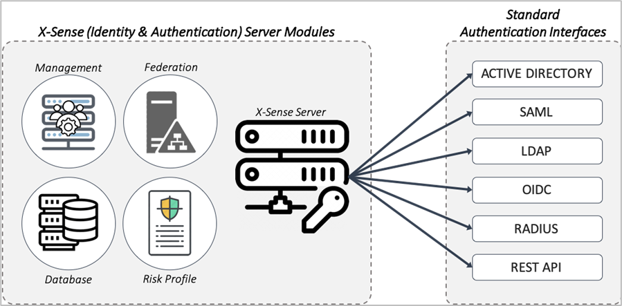

X-Sense Server, featuring Identity & Authentication functions, manages user identities, authenticate users and provide attestations to relying parties. 
 
X-Sense supports integration of AD, SAML, LDAP, OIDC, RADIUS and REST 

## adfasdf

sdfasdf  

